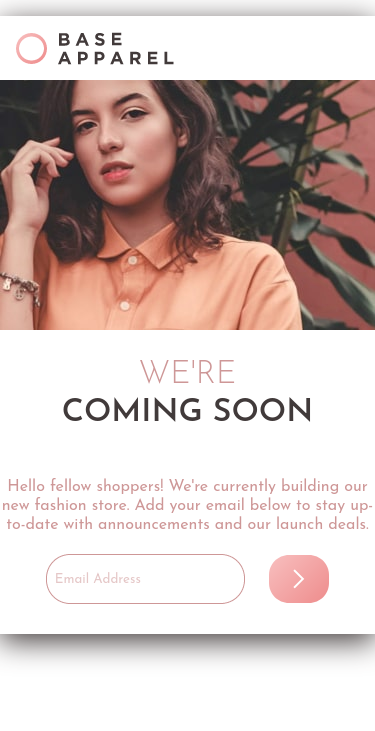
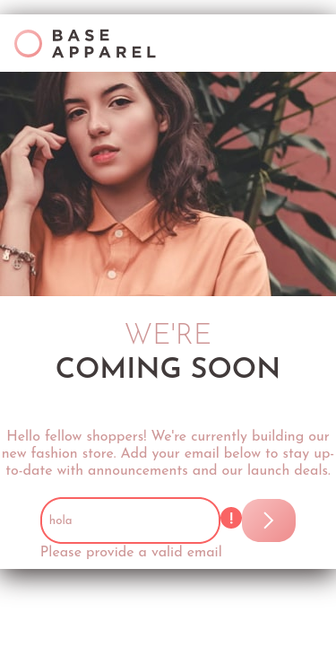
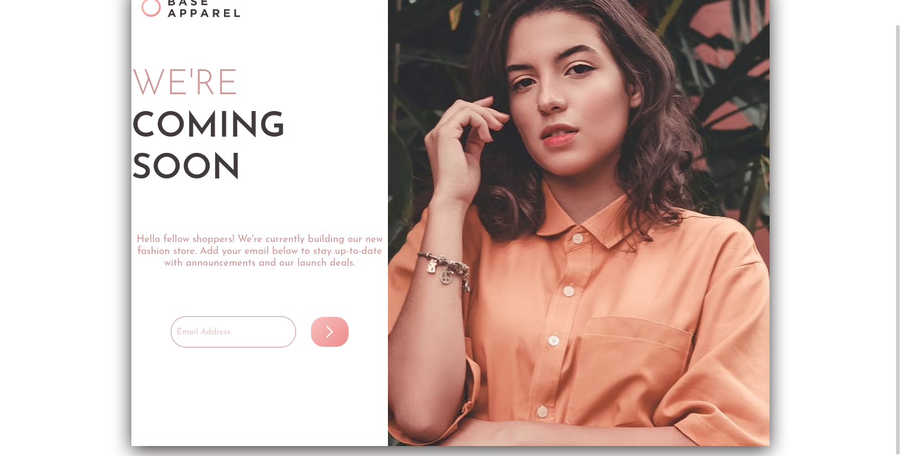

# Frontend Mentor - Base Apparel coming soon page solution - Español

Esta es una solución para el [Base Apparel coming soon page challenge on Frontend Mentor](https://www.frontendmentor.io/challenges/base-apparel-coming-soon-page-5d46b47f8db8a7063f9331a0). Los retos de Frontend Mentor pueden ayudarte a mejorar tus habilidades por medio de crear proyectos reales.

## Tabla de contenidos
- [Información general](#información-general)
  - [El reto](#el-reto)
  - [Screenshot](#screenshot)
  - [Links](#links)
- [Mi proceso](#mi-proceso)
  - [Herramientas utilizadas](#herramientas-utilizadas)
  - [Lo que aprendí](#lo-que-aprendí)
- [Autor](#autor)

### El reto

El usuario debe ser capaz de:

- Ver correctamente el diseño dependiendo la resuloción del dispositivo.
- Ver los diferentes estados al interactuar con la aplicación.
- Recibir un mensaje de error cuando el `form` sea enviado si:
  - El `input` esta vacío.
  - La dirección del correo no está escrita correctamente.

### Screenshot

Mobile



Mobile error



Desktop



Desktop error


### Links

- Solution URL: [Solution page]()
- Live Site URL: [Github pages]()

## Mi proceso

### Herramientas utilizadas

- HTML5
- CSS
- Flexbox
- CSS Grid
- Mobile-first workflow

### Lo que aprendí

Aprendí a como validar un email. Nunca antes lo había hecho.

Use el siguiente código para validar el email. Lo encontré en este [post de Stackoverflow](https://stackoverflow.com/questions/46155/how-to-validate-an-email-address-in-javascript)

```js
function validateEmail(email) {
    const re = /^(([^<>()[\]\\.,;:\s@"]+(\.[^<>()[\]\\.,;:\s@"]+)*)|(".+"))@((\[[0-9]{1,3}\.[0-9]{1,3}\.[0-9]{1,3}\.[0-9]{1,3}\])|(([a-zA-Z\-0-9]+\.)+[a-zA-Z]{2,}))$/;
    return re.test(String(email).toLowerCase());
}
```

## Autor

- Frontend Mentor - [@Caresle](https://www.frontendmentor.io/profile/Caresle)
- Instagram - [@caresle1](https://instagram.com/caresle1)